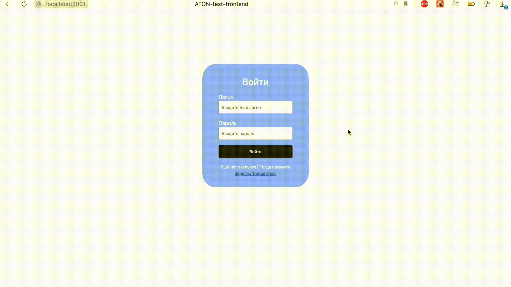

<h1 align="center">Fetch, add, update, remove users</h1>

## Демо

<a href='https://tatimi18.github.io/'>Посмотреть демо-версию проекта</a>

## Описание

<p align="center">
  
</p>

1. Пользователь первоначально находится на странице входа, где он может авторизоваться, если его данные есть в localStorage или перейти на страницу регистрации, где может внести свои данные (они сохранятся в localStorage) и попытаться войти снова. Если данные не совпадут, высветится соответствующее сообщение
2. После успешной авторизации пользователь попадает на страницу с контентом, а именно с таблицей.
С помощью fetch-запроса в таблицу поступают данные пользователей сервиса тестовых REST ответов API reqres.in
3. Если пользователь не авторизирован, то он не может попасть на страницу с контентом
4. При каком-либо изменении контента появляются информативные сообщения, которые самостоятельно исчезают через 2 секунды, также их можно скрыть нажатием на крестик

## Что пользователь может делать после авторизации

<p align="center">
  
</p>

1. Добавить новые данные (объект) на текущую страницу (далее юзер). Юзер добавляется в конец списка со своим уникальным id, id следующих в списке юзеров перезаписываются
2. Изменить данные любого юзера из списка
3. Удалить юзера из списка
4. Переходить по страницам таблицы
5. Выйти из своего аккаунта, тогда пользователя перекинет на страницу входа
6. Управлять количеством отображаемых элементов в таблице
7. Сортировать и фильтровать информацию по столбцам

## Используемые технологии
1. <a href='https://react.dev/'>React</a>
2. <a href='https://www.npmjs.com/package/react-router-dom'>React-router-dom</a>
3. <a href='https://www.npmjs.com/package/bootstrap'>Bootstrap</a>
4. <a href='https://www.npmjs.com/package/react-bootstrap'>React-bootstrap</a>
5. <a href='https://www.npmjs.com/package/semantic-ui-react'>Semantic-ui-react</a>
6. <a href='https://www.npmjs.com/package/react-hook-form'>React-hook-form</a>
7. <a href='https://www.ag-grid.com/'>AG-Grid</a>
8. <a href='https://www.npmjs.com/package/axios'>Axios</a>
9. <a href='https://www.docker.com/'>Docker</a>
10. <a href='https://sass-lang.com/'>SASS</a>

## Запуск проекта
<h3>Из терминала</h3>

```
  npm install
```
```
  npm start
```

### или

<h3>Docker</h3>

1. создать образ по инструкции из Dockerfile

  ```
  docker build -t image-name .
  ```

2. запустить контейнер по образу image-name

  ```
  docker run -d -p 3000:3000 --name container-name image-name
  ```

3. открыть http://localhost:3000

4. остановить контейнер

  ```
  docker stop container-name
  ```
  
## Code style
1. Отступы с использованием табуляции(4 пробела)
2. `;` в конце строк
3. **camelCase** для названия переменных и функций
4. Пример комментария, отделяющего смысловые блоки
```
/* ======= НАЗВАНИЕ БЛОКА ========================================================= */
```
5. Пример однострочного комментария
```
//комментарий в 1 строку
```
6. Пример многострочного комментария
```
/* 
    * много строк много строк много строк много строк много строк много строк много строк
    *  много строк много строк много строк много строк много строк много строк много строк 
*/ 
```
7. Операторы: ( + , =, +=, *=, /,%, ++, — и т.п) отделяются одинарным пробелом с каждой стороны
8. Блоки кода и смысловые блоки кода отделены пустой строкой

 
